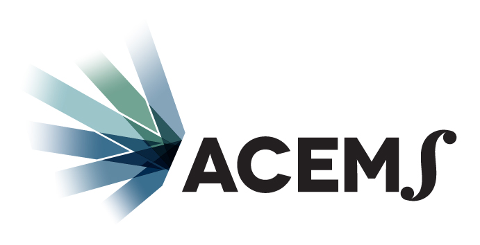
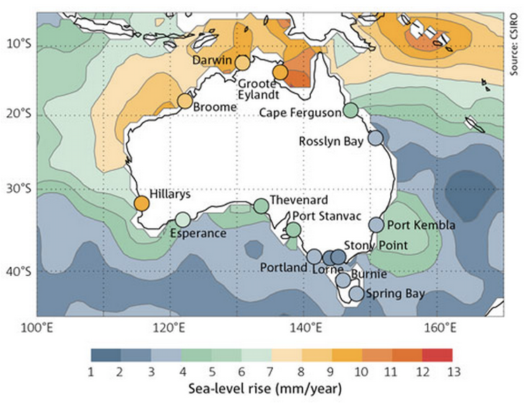

## Header row {data-height=8}

###

<table style="width:100%">
<tr>
  <td>
<h1>
  **The Arrival of Web VR for Communicating Science**
  </h1>
</td>
</tr>
<tr><td>

  <h4>**Miles McBain, Josh Bowden, Kerrie Mengersen, Tomasz Bednarz**</h4>
  
</td>
</tr>
<tr>
  <td>

  </img>
  </img>
  </img>
  
</td>
</tr>
</table> 

**Abstract** The maturing Web VR ecosystem presents scientists with a new and versatile platform for communicating their work. Content rich visualisations of complex phenomena can be shared and viewed on commodity devices like mobile phones. To explore the use of Web VR for this purpose we have created a case study that visualises Mean Sea Level trends in the South Pacific using a mix of observations and published model projections.  

## QR row {data-height=15}

### **Case Study: Pacific Sea Level Visualiation**

Sea level rise is not uniform globally. [The CSIRO has reported](https://www.csiro.au/en/Research/OandA/Areas/Assessing-our-climate/State-of-the-Climate-2016/Oceans-and-Cryosphere)[@Csiro2017-xt] that in Northern Australia and the South Pacific, sea level has been rising at 2-3 times the global average rate since 1993. This can only be partially explained by seasonal effects like El Niño and La Niña.

Maps like the one below and time series plots of sea level are the usual ways of disseminating this information. Our hypothesis is that VR can be used to compliment graphics like as these to give an appreciation of what phenomenon look like at ground level.

</img>

Sea-level rise rates around Australia, as measured by coastal tide gauges (circles) and satellite observations (contours) from January 1993 to December 2011.  CSIRO State of the Climate 2012, CC BY-NC-ND.

### **What does a 0.6m Sea Level Rise look like? https://humdrum-appendix.glitch.me **

The QR code below links to a Virtual Reality visualisation [@McBain_undated-dp] of observed and projected sea level rise at Honiara, Solomon Islands from 1974 to 2100. Over the visualisation timeline the sea level rises by a total of **0.607m**.

</img>

## Body row {data-height=5}

### **Web VR Ecosystem**
The arrival of a maturing open source ecosystem for VR on the Web changes the proposition of VR for scientific visualisation in several important ways: 

* Visualisations can be viewed on anything that has a web browser. Specialised hardware like head-mounted displays and CAVE systems are not required.
* Visualisations are inherently shareable via a URL.
* Open source libraries like and `THREE.js` and `A-FRAME.io` mean visualisations can be coded using non-specialist programming techniques in HTML and Javascript. 
* Open repositories of CC-BY licensed 3D models like `poly.google.com` allow remixing of open content rather than building from scratch.

### **VR and Bayes**

Recent work by the QUT Bayesian Research and Applications Group (BRAG) has shown that VR is a useful tool in eliciting prior distributions for spatial models in the conservation domain[@Bednarz2016-jx; @Brown_R_Bruza_P_Heard_W_Mengersen_K_Murray_J2016-ja]. There are BRAG researchers currently writing up Great Barrier Reef health modelling using VR for this purpose.

We also see VR as a tool worth exploring for:

* The visualisation of model uncertainty. 
* Model acceptance for complex systems.

## Footer row {data-height=1} 

### References {data-width=50}

